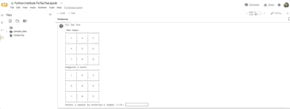
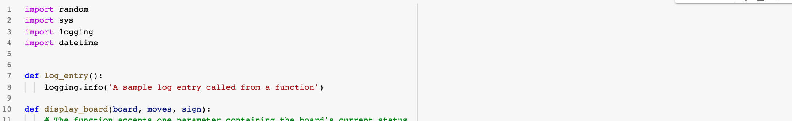
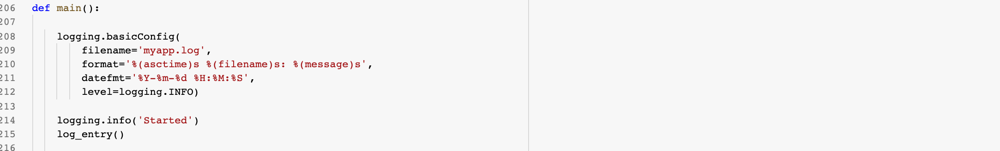
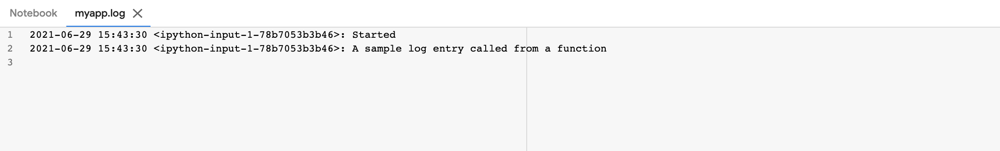

# Python Fundamentals

**Overview:**

The purpose of this document is demonstrate Python programming fundamentals and save time by replace the need for a live technical assessment.  I wrote a game of tic-tac-toe in Python based on a challenge in the Python Institute's basic certification course.  You will observe a wide range of Python and coding practices included like logging, functions, basic operations, data storage formats, and logical expressions.

## Tic-Tac-Toe Game

This is a Python Institute Challenge, written for Google Colab/Jupyter Notebook execution.  It is a monlithic program written entirely in Python and leverages included python libraries and the random, sys, logging, and datetime libraries.

**Game Overview**

This is the game of tic-tac-toe.  The board is, first, drawn on screen with a number representing each square from 1-9. Secondly, the computer always makes the first move by entering an 'X' in the center square.  The player selects an available square by indicating the  number listed on their chosen square.  An 'O' is entered in the square they select.  With the computer's remaining moves, a random square is selected from the remaining available squares.  Turns are alternated until a winner is achieved by entering 3 of their letters in-a-row either up-and-down, across, or diaganally.  The winner will display on the screen and the game is over once a victor is achieved.  

Basic logging is implemented and this sample contains functions, loops, logical expressions, and numerous basic operations.

**Functional programming steps:**
1. Call new_game and set the sign to X (Pc's move) and build the board.
2. Call display_board and draw a new game on screen.
3. Call draw_move and get the pc's move.  1st move is always 5.
4. Call display_board and draw pc move on screen.
5. Call make_list_of_free_fields and check if their selection is valid.
6. Call display_board and draw pc move on screen.
7. Call victory_for and check if the player or pc won the game.
8. Call enter_move and ask player for a move and update board with their selection.
        Call enter_move again and ask for a new selection if their selection is invalid.
9. Call display_board and draw player's move on screen.
10. Call make_list_of_free_fields and check if their selection is valid. 
11. Call display_board and draw the board with the player's move.
12. Call victory_for and check if the player or pc won the game.  
        If X' or O' won print winner.  The game is over.
13. If no winner, repeat steps 1-12 until game is over.

#### **Function Workflow:**
**Computer turn:** new_game -> display_board ->  draw_move -> display_board -> make_list_of_free_fields -> display_board -> victory_for

**Player turn:** enter_move -> display_board -> make_list_of_free_fields -> display_board -> victory_for -> draw_move

### Logging

Simplified logging function with a custom entry that can be placed anywhere in the application.  This useful for debugging and generating audit trails:

Logging configuration with a timestamp set to info.  The logged entries will be saved to a file called myapp.log:

Example logging entires in logged file 'myapp.log':

