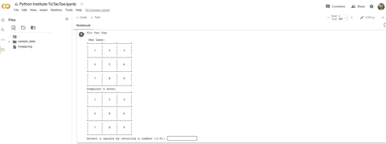

# Python Fundamentals

**Overview:**

The purpose of this document is demonstrate Python programming fundamentals and save time by replace the need for a live technical assessment.  I wrote a game of tic-tac-toe in Python based on a challenge in the Python Institute's basic certification course.  You will observe a wide range of Python and coding practices included like logging, functions, basic operations, data storage formats, and logical expressions.

## Tic-Tac-Toe Game

This is a Python Institute Challenge, written for Google Colab/Jupyter Notebook execution.  It is a monlithic program written entirely in Python and leverages standard python libraries and the random, sys, logging, and datetime libraries.

**Game Overview**

This is the game of tic-tac-toe.  The board is, first, drawn on screen with a number representing each square from 1-9. Secondly, the computer always makes the first move by entering an 'X' in the center square.  The player selects an available square by indicating the  number listed on their chosen square.  An 'O' is entered in the square they select.  With the computer's remaining moves, a random square is selected from the remaining available squares.  Turns are alternated until a winner is achieved by entering 3 of their letters in-a-row either up-and-down, across, or diaganally.  The winner will display on the screen and the game is over once a victor is achieved.  

You will see that basic logging has been implemented and this sample contains functions, loops, logical expressions, and numerous basic operations.

Here is a list of the steps used to generate the application from a functional perspective.  Each application function is called.  Each step below contains a short description of what the function does:

**Functional programming steps:**
1. Call new_game and set the sign to X (Pc's move) and build the board.
2. Call display_board and draw a new game on screen.
3. Call draw_move and get the pc's move.  1st move is always 5.
4. Call display_board and draw pc move on screen.
5. Call make_list_of_free_fields and check if their selection is valid.
6. Call display_board and draw pc move on screen.
7. Call victory_for and check if the player or pc won the game.
8. Call enter_move and ask player for a move and update board with their selection.
        Call enter_move again and ask for a new selection if their selection is invalid.
9. Call display_board and draw player's move on screen.
10. Call make_list_of_free_fields and check if their selection is valid. 
11. Call display_board and draw the board with the player's move.
12. Call victory_for and check if the player or pc won the game.  
        If X' or O' won print winner.  The game is over.
13. If no winner, repeat steps 1-12 until game is over.

Here is a diagram containing the order inwhich each function is called for the PC or Player's move:

#### **Function Workflow:**
**Computer turn:** new_game -> display_board ->  draw_move -> display_board -> make_list_of_free_fields -> display_board -> victory_for

**Player turn:** enter_move -> display_board -> make_list_of_free_fields -> display_board -> victory_for -> draw_move

## Game Play

Here is the game play in action.  The game board and PC's first move is made.  I enter a number for each of my moves.  THe PC and I alternate moves until the game is over:

### Logging

Simplified logging function with a custom entry that can be placed anywhere in the application.  This useful for debugging and generating audit trails:

Logging configuration with a timestamp set to info.  The logged entries will be saved to a file called myapp.log:

Example logging entires in logged file 'myapp.log':

### Functions, Loops, Logical Expressions and Basic Operations

Function to build and draw the board on screen.  The intital board contains values from 1 through 9.  The computer's intitial move is drawn to the screen at square 5.  The function has a 'For' statement that creates the unique rows needed to draw the board and leverages arrays to populate the variable information on the board.  You can see proper use of docstrings here.

This function flips the sign  from 'X's" to "O's" which is used to signify who's turn it is.  Next, the function calls 'victor_for'.  The victor_for' is a function that determines if a player has scored 3-in-a-row. The game is ends when one player scores 3-in-a-row.  If there is no winner, then this function calls a distinct function for each player that handles each their move.  This example demonstrates basic operations, data types, and logical expressions including if/else statements.

Here is the output of the function:  A drawn empty board and the first move by the PC.  An "X" at position 5.

### Space-Time Complexity - Big O

Here are 2 examples, in the Tic-Tac-Toe application where the time and space complexity are both O(n):

## Example 1
A set operation:  This set operation iterates through a finite list of 9 values and if the board's square isn't already set then board's square is set to equal the sign.

This example uses linear search to iterate through the finite list of winning cobination and performs a series of true/false checks to determin if the player has, in fact, set the board to equal one of the winning combinations.  BigO representation of O(n) here is the ideal scenerio for a search operation.

## Example 2
The finite list of lookup values.  They are represent as a list of tuples for each possible board combination:

A while statement that loops through the possible winning combinations. If a winning combination is determined to be true (and if the sign is set to the player) the application prints that the game has ended and the player won.  If the sign that represents the PC is set then the application prints that the PC won and the game is over:

